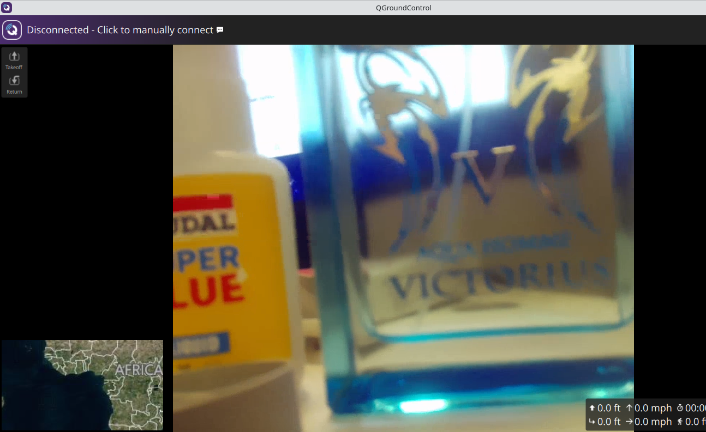
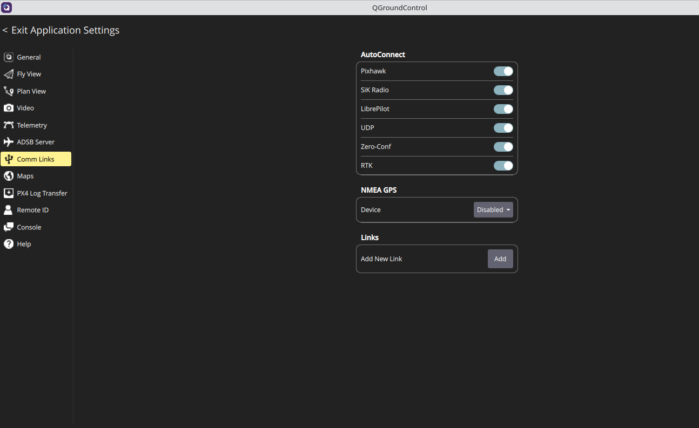
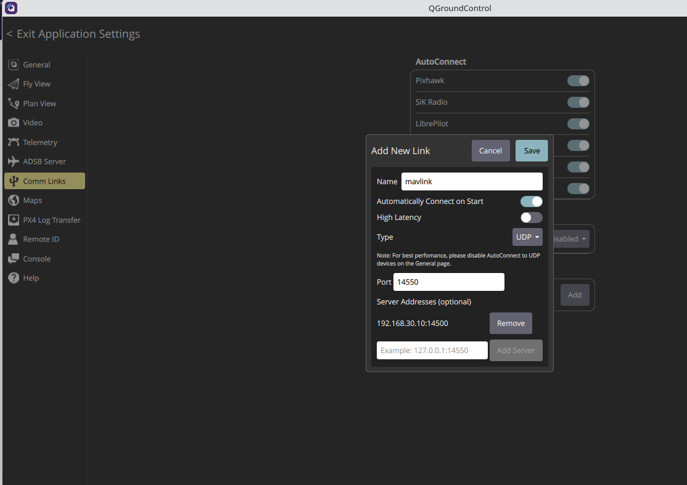

# QGroundControl

## What Is QGroundControl?

**QGroundControl (QGC)** is a cross-platform Ground Control Station (GCS) software used to monitor, configure, and control drones running **MAVLink-compatible** autopilots such as ArduPilot and PX4.

It provides:
- Real-time telemetry visualization  
- Mission planning (waypoints, surveys, geofencing)  
- Parameter configuration and tuning  
- Video streaming support (RTSP, UDP, WFB, etc.)  
- Joystick/RC input for manual control  
- Log analysis and system health monitoring  

QGroundControl is available for:
- **Windows**
- **macOS**
- **Linux**
- **Android**
- **iOS** (limited features)

It is widely used in both hobbyist and professional drone ecosystems because of its clean UI, ease of use, and strong MAVLink support.

---

## Where to Get the Latest Version?

The official downloads are available on the QGroundControl website:

👉 **https://qgroundcontrol.com/downloads/**

Here you can find:
- Latest stable release  
- Daily builds  
- Mobile versions (APK for Android)  
- Older releases for compatibility  

Source code is available on GitHub:

👉 **https://github.com/mavlink/qgroundcontrol**

If using **custom hardware** (WFB or companion computers), the **AppImage (Linux)** or **Windows installer** is recommended for compatibility.

---
## Ip configuration

Configure your network interface (Ethernet or Wi-Fi) with the following static IP:
192.168.30.5

Example configuration:
```
enx00e04c6806cf: flags=4163<UP,BROADCAST,RUNNING,MULTICAST>  mtu 1500
inet 192.168.30.5  netmask 255.255.255.0  broadcast 192.168.30.255
inet6 fe80::8064:a0dc:b8bc:4f6a  prefixlen 64  scopeid 0x20<link>
ether 00:e0:4c:68:06:cf  txqueuelen 1000  (Ethernet)
RX packets 0  bytes 0 (0.0 B)
RX errors 0  dropped 0  overruns 0  frame 0
TX packets 0  bytes 0 (0.0 B)
TX errors 0  dropped 0 overruns 0  carrier 0  collisions 0
```

---

## QGroundControl. Video configuration

Go to
**Application settings > Video > Connection**
set udp url 192.168.30.5:5600


Return to the main screen and verify the video stream:  


---
## QGroundControl. Mavlink configuration

1. Go to  
**Application Settings → Comm Links → Add New Link**

2. Configure your MAVLink connection parameters as required by your Ground S
